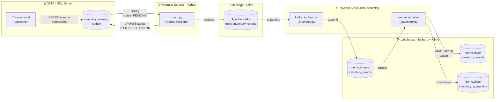

# PySpark Kafka Streaming — Inventory Events Pipeline

A near-real-time data pipeline for inventory movement events, built on top of the **Transactional Outbox pattern** and the **Medallion Architecture** (Bronze / Silver). Events are captured from an _outbox_ table in SQL Server, published to **Apache Kafka**, ingested by **PySpark Structured Streaming**, and persisted as **Apache Iceberg** tables on **MinIO** (S3-compatible storage).

> Built as a hands-on study of streaming data engineering, integrating established distributed-systems patterns (Outbox, Medallion, dead-letter quarantine, idempotent upsert).

---

## 📐 Architecture



---

## 🧱 Stack

| Layer                  | Technology                                |
| ---------------------- | ----------------------------------------- |
| OLTP database          | SQL Server (ODBC Driver 18 via `pyodbc`)  |
| Message broker         | Apache Kafka                              |
| Stream processing      | PySpark Structured Streaming              |
| Table format           | Apache Iceberg (REST Catalog)             |
| Object storage         | MinIO (S3-compatible, via `s3a://`)       |
| Local orchestration    | Docker + Docker Compose                   |
| Language               | Python 3.11                               |

---

## 🗂️ Project Structure

```
pyspark_kafka_streaming/
├── Dockerfile                          # Producer image (Python + msodbcsql18)
├── docker-compose.producer.yaml        # Brings the producer up on the Iceberg network
├── requirements.txt                    # Producer deps (pyodbc, kafka-python, dotenv)
├── .env.example                        # Environment-variable template
│
├── src/
│   ├── main.py                         # Outbox Publisher main loop
│   ├── config.py                       # Loads settings from .env
│   ├── database.py                     # SQL Server connection
│   ├── outbox_repository.py            # SELECT pending / mark PUBLISHED / ERROR
│   ├── kafka_producer.py               # KafkaProducer with custom JSON serializer
│   ├── spark_session.py                # SparkSession + Iceberg + MinIO config
│   └── jobs/
│       └── kafka_to_bronze_inventory.py   # Streaming job: Kafka → Bronze
│
└── bronze_to_silver_inventory.py       # Streaming job: Bronze → Silver / Quarantine
```

---

## 🔁 Detailed Data Flow

### 1. Outbox in SQL Server

The transactional application writes inventory-movement events to the `inventory_events_outbox` table **inside the same transaction** as the actual stock changes. This guarantees that an event exists **if and only if** the business change was committed — solving the classic dual-write problem between database and broker.

Each row carries:

| Column         | Description                                         |
| -------------- | --------------------------------------------------- |
| `event_id`     | Surrogate key, used for downstream deduplication    |
| `movement_id`  | Business key — also used as Kafka message key       |
| `product_id`   | Product identifier                                  |
| `warehouse_id` | Warehouse identifier                                |
| `quantity`     | Movement quantity (positive = in, negative = out)   |
| `event_type`   | Movement type (INBOUND, OUTBOUND, ADJUSTMENT, ...)  |
| `created_at`   | When the event was created                          |
| `status`       | `PENDING` → `PUBLISHED` / `ERROR`                   |

### 2. Outbox Publisher (`src/main.py`)

Long-running Python service that:

1. Polls the outbox for `status = 'PENDING'` rows in batches (`PUBLISHER_BATCH_SIZE`, default 10).
2. For each event, produces to Kafka using `movement_id` as the key (ensuring per-product ordering in the same partition).
3. Marks each row as `PUBLISHED` on success or `ERROR` on failure.
4. Sleeps `PUBLISHER_SLEEP_SECONDS` (default 5 s) and repeats.

The Kafka producer uses `acks="all"` and `retries=3`, providing at-least-once delivery. Duplicate handling is delegated to the Silver layer.

### 3. Bronze Layer (`src/jobs/kafka_to_bronze_inventory.py`)

PySpark Structured Streaming job that:

- Reads from Kafka starting at `earliest`.
- Parses the JSON payload using a strict typed schema.
- Persists the raw event **plus Kafka metadata** (`topic`, `partition`, `offset`, `kafka_timestamp`) and an ingestion timestamp into the Iceberg table `demo.bronze.inventory_events`.

> The Bronze layer is **append-only** and acts as the immutable system of record — any downstream issue can be replayed from here.

### 4. Silver Layer (`bronze_to_silver_inventory.py`)

PySpark Structured Streaming job that consumes the Bronze table (using Iceberg's `stream-from-timestamp` source) on a 1-minute trigger and applies per-batch:

1. **Deduplication** by `event_id`, keeping the row with the latest `kafka_timestamp` (window + `row_number`).
2. **Validation** — rows with `NULL` in any required field (`product_id`, `warehouse_id`, `quantity`) are split into a quarantine DataFrame with a `rejection_reason` explaining which fields are null.
3. **Idempotent upsert** into `demo.silver.inventory_events` via `DELETE` by `event_id` list followed by `INSERT`.
4. **Quarantine** — invalid rows are appended to `demo.silver.inventory_quarantine` for later inspection and reprocessing.

> **Why `DELETE` + `INSERT` instead of `MERGE`?** Iceberg's SQL `MERGE` cannot use Spark temp views as the `USING` source when multiple catalogs are active — the Iceberg planner resolves names against its own catalog and the view becomes invisible. Collecting `event_id`s to the driver and running a targeted `DELETE` followed by an `append` keeps the operation idempotent and replay-safe.

---

## ⚙️ Environment Variables

Copy `.env.example` to `.env` and fill in your values:

```bash
# SQL Server
SQL_SERVER_DRIVER=ODBC Driver 18 for SQL Server
SQL_SERVER_HOST=host.docker.internal
SQL_SERVER_PORT=1433
SQL_SERVER_DATABASE=AdventureWorksLT2022
SQL_SERVER_USER=sa
SQL_SERVER_PASSWORD=<your-password>
SQL_SERVER_TRUST_CERTIFICATE=yes

# Kafka
KAFKA_BOOTSTRAP_SERVERS=kafka:9092
KAFKA_TOPIC=inventory_events

# Publisher
PUBLISHER_BATCH_SIZE=10
PUBLISHER_SLEEP_SECONDS=5

# Iceberg
ICEBERG_CATALOG=demo
ICEBERG_REST_URI=http://rest:8181
ICEBERG_WAREHOUSE=s3://warehouse/

# MinIO
MINIO_ENDPOINT=http://minio:9000
MINIO_ACCESS_KEY=admin
MINIO_SECRET_KEY=<your-secret>
```

> ⚠️ **Never commit `.env`** to source control. The file is already listed in `.gitignore`.

---

## 🚀 How to Run

### Prerequisites

- Docker and Docker Compose
- An external Docker network named `iceberg_iceberg_net` running:
  - Kafka broker
  - Iceberg REST catalog (default port `8181`)
  - MinIO (default port `9000`)
- SQL Server reachable from the producer container (the default `host.docker.internal` assumes a local SQL Server on the host machine)
- A Spark cluster (or local Spark) able to reach the same network for the streaming jobs

### 1. Producer (SQL Server → Kafka)

```bash
docker compose -f docker-compose.producer.yaml up --build
```

The producer container starts and immediately begins polling the outbox table.

### 2. Bronze streaming job (Kafka → Iceberg)

From a machine with `spark-submit` and access to the same network:

```bash
spark-submit \
  --packages org.apache.iceberg:iceberg-spark-runtime-3.5_2.12:1.5.0,\
org.apache.spark:spark-sql-kafka-0-10_2.12:3.5.0,\
org.apache.hadoop:hadoop-aws:3.3.4 \
  src/jobs/kafka_to_bronze_inventory.py
```

### 3. Silver streaming job (Bronze → Silver + Quarantine)

```bash
spark-submit \
  --packages org.apache.iceberg:iceberg-spark-runtime-3.5_2.12:1.5.0,\
org.apache.hadoop:hadoop-aws:3.3.4 \
  bronze_to_silver_inventory.py
```

> Adjust package versions to match your Spark / Scala build.

---

## 📊 Table Schemas

### `demo.bronze.inventory_events`

Raw events with Kafka metadata, append-only:

| Column                        | Type        |
| ----------------------------- | ----------- |
| `event_id`                    | `INT`       |
| `movement_id`                 | `INT`       |
| `product_id`                  | `INT`       |
| `warehouse_id`                | `INT`       |
| `quantity`                    | `INT`       |
| `event_type`                  | `STRING`    |
| `created_at`                  | `TIMESTAMP` |
| `status`                      | `STRING`    |
| `kafka_key`                   | `STRING`    |
| `topic`                       | `STRING`    |
| `partition`                   | `INT`       |
| `offset`                      | `BIGINT`    |
| `kafka_timestamp`             | `TIMESTAMP` |
| `bronze_ingestion_timestamp`  | `TIMESTAMP` |

### `demo.silver.inventory_events`

Deduplicated and validated events, idempotently upserted by `event_id`. Same schema as Bronze plus `silver_ingestion_timestamp`.

### `demo.silver.inventory_quarantine`

Invalid events (one or more required field is `NULL`). Same schema as Bronze plus:

| Column             | Type        | Description                            |
| ------------------ | ----------- | -------------------------------------- |
| `rejection_reason` | `STRING`    | Lists which required fields are null   |
| `rejected_at`      | `TIMESTAMP` | When the row was quarantined           |
| `source_batch_id`  | `BIGINT`    | Spark `batch_id` that produced the row |

---

## 🧠 Design Decisions

- **Transactional Outbox** — eliminates the dual-write problem between SQL Server and Kafka; the broker receives only events that were actually committed.
- **Medallion Architecture** — clear separation of concerns: Bronze keeps raw history, Silver delivers a curated and queryable source of truth.
- **At-least-once + downstream dedup** — Kafka delivery is at-least-once (`acks=all`, retries); deduplication by `event_id` in the Silver layer makes the pipeline effectively exactly-once.
- **Data quarantine** — invalid rows are isolated rather than dropped, preserving auditability and enabling reprocessing.
- **Idempotent upsert** — `DELETE` + `INSERT` by `event_id` allows safe replay of any Bronze range without producing duplicates.
- **Kafka key = `movement_id`** — guarantees ordering for events of the same movement (same partition).
- **Iceberg via REST catalog + MinIO** — fully open-source lakehouse setup that mirrors AWS Glue + S3 in production.

---

## 🛣️ Roadmap

- [ ] **Gold layer** with curated aggregates (current stock per `(product_id, warehouse_id)`, KPIs).
- [ ] **CDC instead of polling** — replace the publisher with Debezium for sub-second latency.
- [ ] **Schema Registry** (Confluent / Apicurio) and migration from JSON to **Avro / Protobuf**.
- [ ] **Observability** — metrics (Prometheus), structured logs, and lineage (OpenLineage / Marquez).
- [ ] **Tests** — unit tests for the transformations and integration tests with Testcontainers (Kafka + SQL Server).
- [ ] **CI/CD** — GitHub Actions for lint, tests, and image build/push.
- [ ] **Orchestration** — Airflow or Dagster for the streaming jobs and operational tasks.

---

## 📚 References

- [Transactional Outbox Pattern — Microservices.io](https://microservices.io/patterns/data/transactional-outbox.html)
- [Medallion Architecture — Databricks](https://www.databricks.com/glossary/medallion-architecture)
- [Apache Iceberg Documentation](https://iceberg.apache.org/docs/latest/)
- [Spark Structured Streaming](https://spark.apache.org/docs/latest/structured-streaming-programming-guide.html)

---

## 📄 License

This project is available for study and portfolio purposes.
